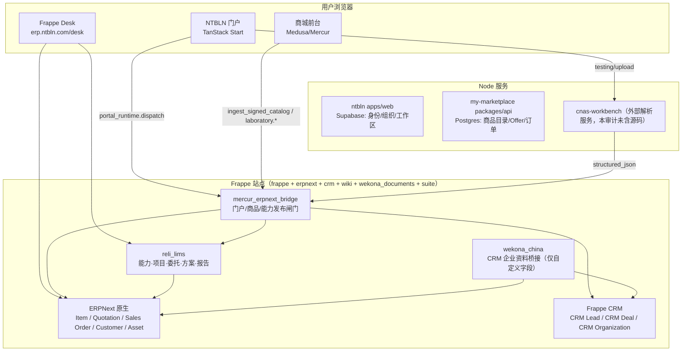

# 图 1 · 四仓库系统总体架构

```mermaid
graph TB
  subgraph Browser["用户浏览器"]
    Desk["Frappe Desk<br/>erp.ntbln.com/desk"]
    Portal["NTBLN 门户<br/>TanStack Start"]
    Shop["商城前台<br/>Medusa/Mercur"]
  end

  subgraph Bench["Frappe 站点（frappe + erpnext + crm + wiki + wekona_documents + suite）"]
    RL["reli_lims<br/>能力·项目·委托·方案·报告"]
    WC["wekona_china<br/>CRM 企业资料桥接（仅自定义字段）"]
    BR["mercur_erpnext_bridge<br/>门户/商品/能力发布闸门"]
    ERPN["ERPNext 原生<br/>Item / Quotation / Sales Order / Customer / Asset"]
    CRM["Frappe CRM<br/>CRM Lead / CRM Deal / CRM Organization"]
  end

  subgraph Node["Node 服务"]
    N1["ntbln apps/web<br/>Supabase: 身份/组织/工作区"]
    N2["my-marketplace packages/api<br/>Postgres: 商品目录/Offer/订单"]
    N3["cnas-workbench（外部解析服务，本审计未含源码）"]
  end

  Desk --> RL
  Desk --> ERPN
  Portal -->|portal_runtime.dispatch| BR
  Shop -->|ingest_signed_catalog / laboratory.*| BR
  Portal -->|testing/upload| N3
  N3 -->|structured_json| BR
  BR --> RL
  BR --> ERPN
  BR --> CRM
  RL --> ERPN
  WC --> CRM
  WC --> ERPN
```

说明：`cnas-workbench` 的具体实现不在本次审计范围内（证据不足），此处只标其接口位置。
