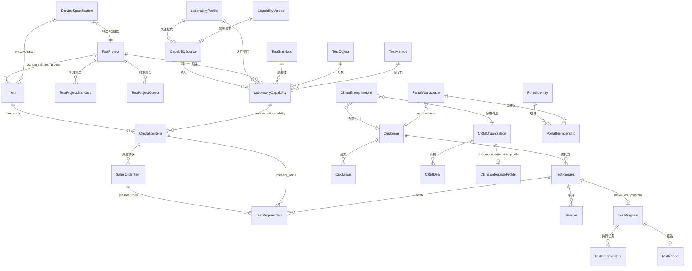

# 图 2 · 四仓库核心数据实体 ER

```mermaid
erDiagram
  LaboratoryProfile ||--o{ CapabilitySource : "来源批次"
  CapabilitySource ||--o{ LaboratoryCapability : "导入"
  CapabilityUpload ||--o| CapabilitySource : "幂等请求"
  LaboratoryProfile ||--o{ LaboratoryCapability : "认可范围"
  TestProject ||--o{ LaboratoryCapability : "归并"
  TestStandard ||--o{ LaboratoryCapability : "必要性"
  TestObject ||--o{ LaboratoryCapability : "对象"
  TestMethod ||--o{ LaboratoryCapability : "旧字典"
  TestProject ||--o{ TestProjectStandard : "标准集合"
  TestProject ||--o{ TestProjectObject : "对象集合"
  TestProject ||--o{ Item : "custom_reli_test_project"
  Item ||--o{ QuotationItem : "item_code"
  LaboratoryCapability ||--o{ QuotationItem : "custom_reli_capability"
  QuotationItem ||--o{ SalesOrderItem : "原生转换"
  SalesOrderItem ||--o{ TestRequestItem : "prepare_lines"
  QuotationItem ||--o{ TestRequestItem : "prepare_items"
  TestRequest ||--o{ TestRequestItem : "items"
  TestRequest ||--o{ Sample : "收样"
  TestRequest ||--o| TestProgram : "make_test_program"
  TestProgram ||--o{ TestProgramItem : "执行任务"
  TestProgram ||--o| TestReport : "报告"
  Customer ||--o{ Quotation : "买方"
  Customer ||--o{ TestRequest : "委托方"
  CRMOrganization ||--o{ CRMDeal : "商机"
  CRMOrganization ||--o| ChinaEnterpriseProfile : "custom_cn_enterprise_profile"
  ChinaEnterpriseLink }o--|| Customer : "多态引用"
  ChinaEnterpriseLink }o--|| CRMOrganization : "多态引用"
  PortalIdentity ||--o{ PortalMembership : "成员"
  PortalWorkspace ||--o{ PortalMembership : "工作区"
  PortalWorkspace }o--|| Customer : "erp_customer"

  ServiceSpecification ||--o{ Item : "PROPOSED"
  ServiceSpecification }o--|| TestProject : "PROPOSED"
```

`ServiceSpecification` 为虚线概念：**代码中不存在**，仅在本图中标注建议位置。
