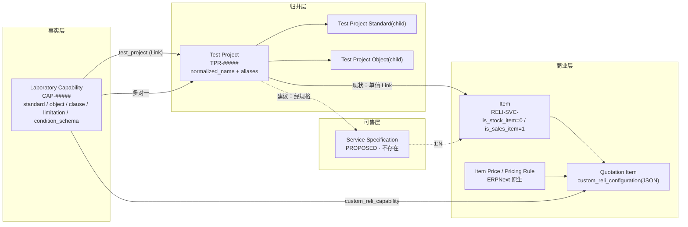

# 图 3 · Capability → Test Project → Service Specification(PROPOSED) → Item

```mermaid
graph LR
  subgraph 事实层
    CAP["Laboratory Capability<br/>CAP-#####<br/>standard / object / clause / limitation / condition_schema"]
  end

  subgraph 归并层
    TP["Test Project<br/>TPR-#####<br/>normalized_name + aliases"]
    TPS["Test Project Standard(child)"]
    TPO["Test Project Object(child)"]
  end

  subgraph 可售层
    SPEC["Service Specification<br/>PROPOSED · 不存在"]
  end

  subgraph 商业层
    ITEM["Item<br/>RELI-SVC-<sha256(project)[:16]><br/>is_stock_item=0 / is_sales_item=1"]
    QI["Quotation Item<br/>custom_reli_configuration(JSON)"]
    PRI["Item Price / Pricing Rule<br/>ERPNext 原生"]
  end

  CAP -->|"test_project (Link)"| TP
  CAP -->|"多对一"| TP
  TP --> TPS
  TP --> TPO
  TP -->|"现状：单值 Link"| ITEM
  TP -.->|"建议：经规格"| SPEC
  SPEC -.->|"1:N"| ITEM
  ITEM --> QI
  PRI --> QI
  CAP -->|"custom_reli_capability"| QI
```

现状：`Test Project` 与 `Item` 之间是单值 Link（`Item.custom_reli_test_project`），代码在项目不一致时 throw；规格层未实现。
