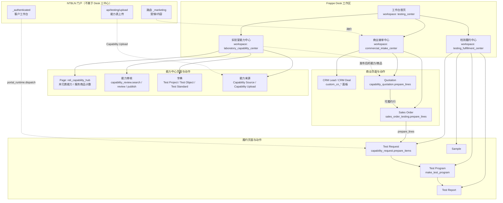

# 图 4 · 三个中心（Desk）+ 门户的页面与职责

```mermaid
graph TB
  subgraph Desk["Frappe Desk 工作区"]
    HOME["工作台首页<br/>workspace: testing_center"]
    CAPC["实验室能力中心<br/>workspace: laboratory_capability_center"]
    FC["检测履约中心<br/>workspace: testing_fulfillment_center"]
    COM["商业接单中心<br/>workspace: commercial_intake_center"]
  end

  subgraph CapPages["能力中心页面与动作"]
    HUB["Page: reli_capability_hub<br/>未归类能力 / 服务商品计数"]
    REVIEW["能力审核<br/>capability_review.search / review / publish"]
    CAT["字典<br/>Test Project / Test Object / Test Standard"]
    SRC["能力来源<br/>Capability Source / Capability Upload"]
  end

  subgraph ComPages["商业页面与动作"]
    LEAD["CRM Lead / CRM Deal<br/>custom_cn_* 面板"]
    QTN["Quotation<br/>capability_quotation.prepare_lines"]
    SO["Sales Order<br/>sales_order_testing.prepare_lines"]
  end

  subgraph FulPages["履约页面与动作"]
    REQ["Test Request<br/>capability_request.prepare_items"]
    SMP["Sample"]
    PRG["Test Program<br/>make_test_program"]
    RPT["Test Report"]
  end

  subgraph Portal["NTBLN 门户（不属于 Desk 三中心）"]
    MKT["路由 _marketing<br/>营销/内容"]
    WORK["_authenticated<br/>客户工作台"]
    UPL["api/testing/upload<br/>能力表上传"]
  end

  HOME --> CAPC
  HOME --> FC
  HOME --> COM
  CAPC --> HUB
  CAPC --> REVIEW
  CAPC --> CAT
  CAPC --> SRC
  COM --> LEAD
  COM --> QTN
  COM --> SO
  FC --> REQ
  FC --> SMP
  FC --> PRG
  FC --> RPT

  CAPC -.->|"发布后的能力/商品"| QTN
  QTN -->|"可履约行"| SO
  SO -->|"prepare_lines"| REQ
  REQ --> PRG
  PRG --> RPT
  MKT -.->|"询价"| COM
  WORK -.->|"portal_runtime.dispatch"| REQ
  UPL -.->|"Capability Upload"| SRC
```

角色：Lab Manager（能力审核/发布）、Lab Engineer（履约执行）、Lab Reviewer（复核）、Mercur Integration（服务身份）、Laboratory Directory Reader（只读目录）。
