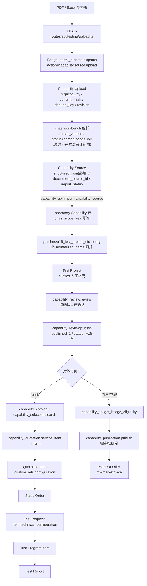

# 图 5 · 能力文件上传→解析→审核→发布→销售→履约

```mermaid
flowchart TD
  A["PDF / Excel 能力表"] --> B["NTBLN routes/api/testing/upload.ts"]
  B --> C["Bridge: portal_runtime.dispatch<br/>action=capability.source.upload"]
  C --> D["Capability Upload<br/>request_key / content_hash / dedupe_key / revision"]
  D --> E["cnas-workbench 解析<br/>parser_version / status=parsed|needs_ocr<br/>（源码不在本次审计范围）"]
  E --> F["Capability Source<br/>structured_json(必填) / documents_source_id / import_status"]
  F -->|"capability_api.import_capability_source"| G["Laboratory Capability 行<br/>cnas_scope_key 幂等"]
  G --> H["patches/p16_test_project_dictionary<br/>按 normalized_name 归并"]
  H --> I["Test Project<br/>aliases 人工补充"]
  I --> J["capability_review.review<br/>待确认→已确认"]
  J --> K["capability_review.publish<br/>published=1 / status=已发布"]
  K --> L{"对外可见？"}
  L -->|"Desk"| M["capability_catalog / capability_selection.search"]
  L -->|"门户/商城"| N["capability_api.get_bridge_eligibility"]
  N --> O["capability_publication.publish<br/>需审批绑定"]
  M --> P["capability_quotation.service_item<br/>→ Item"]
  P --> Q["Quotation Item<br/>custom_reli_configuration"]
  O --> R["Medusa Offer<br/>my-marketplace"]
  Q --> S["Sales Order"]
  S --> T["Test Request Item.technical_configuration"]
  T --> U["Test Program Item"]
  U --> V["Test Report"]
```

关键幂等键：`Capability Upload.request_key`、`Capability Source.documents_source_id`、`Laboratory Capability.cnas_scope_key`、`Mercur Sync Event.idempotency_key`。
