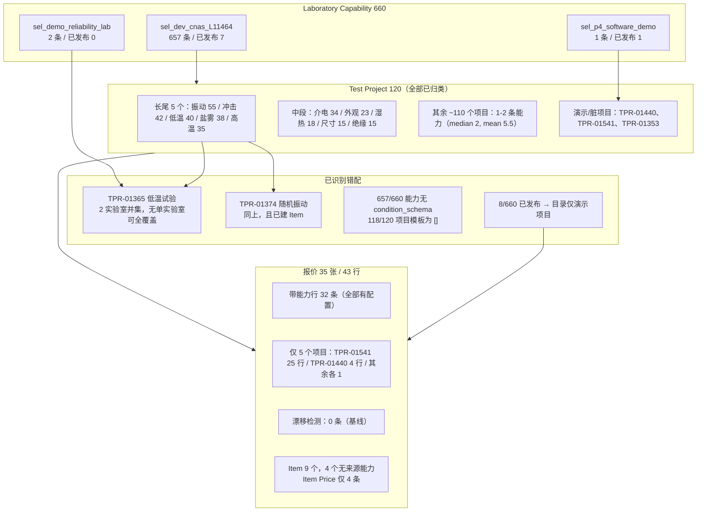

# 图 7 · 阶段 0 真实数据分布（开发站 2026-11-18）

```mermaid
graph TD
  subgraph CAP["Laboratory Capability 660"]
    C1["sel_dev_cnas_L11464<br/>657 条 / 已发布 7"]
    C2["sel_demo_reliability_lab<br/>2 条 / 已发布 0"]
    C3["sel_p4_software_demo<br/>1 条 / 已发布 1"]
  end

  subgraph PROJ["Test Project 120（全部已归类）"]
    P1["长尾 5 个：振动 55 / 冲击 42 / 低温 40 / 盐雾 38 / 高温 35"]
    P2["中段：介电 34 / 外观 23 / 湿热 18 / 尺寸 15 / 绝缘 15"]
    P3["其余 ~110 个项目：1-2 条能力（median 2, mean 5.5）"]
    P4["演示/脏项目：TPR-01440、TPR-01541、TPR-01353"]
  end

  subgraph RISK["已识别错配"]
    R1["TPR-01365 低温试验<br/>2 实验室并集，无单实验室可全覆盖"]
    R2["TPR-01374 随机振动<br/>同上，且已建 Item"]
    R3["657/660 能力无 condition_schema<br/>118/120 项目模板为 []"]
    R4["8/660 已发布 → 目录仅演示项目"]
  end

  subgraph QUOT["报价 35 张 / 43 行"]
    Q1["带能力行 32 条（全部有配置）"]
    Q2["仅 5 个项目：TPR-01541 25 行 / TPR-01440 4 行 / 其余各 1"]
    Q3["漂移检测：0 条（基线）"]
    Q4["Item 9 个，4 个无来源能力<br/>Item Price 仅 4 条"]
  end

  C1 --> PROJ
  C2 --> R1
  C3 --> P4
  P1 --> R1
  P1 --> R2
  PROJ --> QUOT
  R4 --> QUOT
```

数据来源：`data/coverage_matrix.csv`、`data/project_variance.csv`、`data/quotation_drift.csv`（脚本 `tools/a2_audit.py`，只读）。
